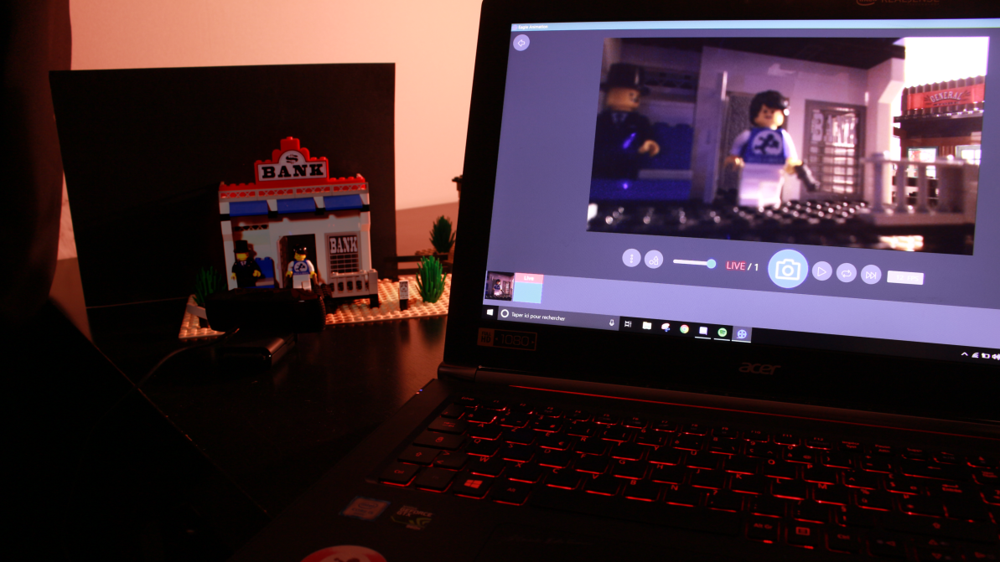

# EagleAnimation

 

**EagleAnimation** is an awesome, free and open-source stop motion animation software. It is available for Windows, macOS and Linux.

👉 _This project is supported by Brick à Brack, the non-profit organization that owns [Brickfilms.com](https://brickfilms.com/) - The biggest brickfilming community, you can join us, it's free and
without ads!_ 🎥

- ✨ **Canon DSLR cameras support** - Use and configure your Canon DSLR camera directly.
- ❤️ **Friendly timeline** - Instantly preview your animation, duplicate and reorganize frames as you want.
- 😎 **The highest quality** - Use all the power of your camera and animate with the best quality possible!
- 💡 **Animator tools** - Thanks to onion skin, grid tools and difference mode, animating has never been so easy.
- 💾 **Easy export** - Export your animation to a video file or export frames to use them in video editing software.
- ⚙️ **Adjust camera settings** - Control and adjust your camera settings.
- 🪄 **Frame averaging** - Capture several frames and merge them to reduce picture noise automatically.
- 🥖 **Oui-Oui-Baguette** - The software is available in several languages to allow everyone to use it.

## Downloads and license

Eagle Animation can be downloaded from the [Github releases page](https://github.com/brick-a-brack/eagle-animation/releases).

The source code is published under [GPLv3](http://www.gnu.org/licenses/gpl.html).

## Credits

The logo was created by Nishant Shukla and sound effects were obtained from [Zapsplat.com](https://zapsplat.com/).

## Contribute

Feel free to make pull-requests, help us to translate the software or report issues 😉

## Configuration

Some variables can be configured using a `.env` file, values with a "\*" are required.

| **Name**         | **Description**                                                                                         | **Example**                                |
| ---------------- | ------------------------------------------------------------------------------------------------------- | ------------------------------------------ |
| VITE_PUBLIC_URL  | The full url of the assets server, must be ended by a slash "/". If it is not defined, we will use "/". | `https://web-ea.brickfilms.com/`           |
| VITE_COMMIT_HASH | The hash of the current git commit, if it is not provided, the bundle will be flagged as "local".       | `cda02bf88498ce97d947fb357a6e4f459812122a` |

### Build process

- Run `npm i --force` to install dependencies (`--force` is required because we use an old dependency).
- Update `src/config.js` file if needed.
- Run `npm run build:win`, `npm run build:linux`, `npm run build:mac` and `npm run build:web` to build release files.

### Release process

- Update `version` value in `package.json` if needed.
- Create a draft release on Github and tag it with the same version number: `vX.X.X`.
- Merge your branch/dev into master.

### Development mode

- Run `npm i --force` to install dependencies.
- Run `npm run start:electron` to launch the application in dev mode.
- Run `npm run start:web` to launch the web app in dev mode.

### Telemetry

To improve the quality of **Eagle Animation**, runtime errors are automatically reported to developpers by using [Sentry SDK](https://sentry.io/). You can disable error reporting, just set
`SENTRY_DSN` to `""` in `src/config.js` and rebuild the app.

### Compatilibity

Some features are device-dependent or platform-limited. Here's a summary table.

| Feature                                           | Windows | MacOS | Linux | Web (Chrome / Edge) | Web (Firefox) | Web (Safari) |
| ------------------------------------------------- | ------- | ----- | ----- | ------------------- | ------------- | ------------ |
| Use webcam to take photos                         | ✅      | ✅    | ✅    | ✅                  | ✅            | ✅           |
| Export captured frames                            | ✅      | ✅    | ✅    | ✅                  | ✅            | ✅           |
| Video export                                      | ✅      | ✅    | ✅    | ✅                  | ✅            | ✅           |
| Improve quality by reducing the preview framerate | ✅      | ✅    | ✅    | ✅                  | ❌            | ❓           |
| Control webcam settings                           | ✅      | ✅    | ✅    | ✅                  | ❌            | ❓           |
| Workshop features                                 | ✅      | ✅    | ✅    | ❌                  | ❌            | ❌           |
| Use Canon camera to take photos                   | ✅      | ❌    | ❌    | ❌                  | ❌            | ❌           |
