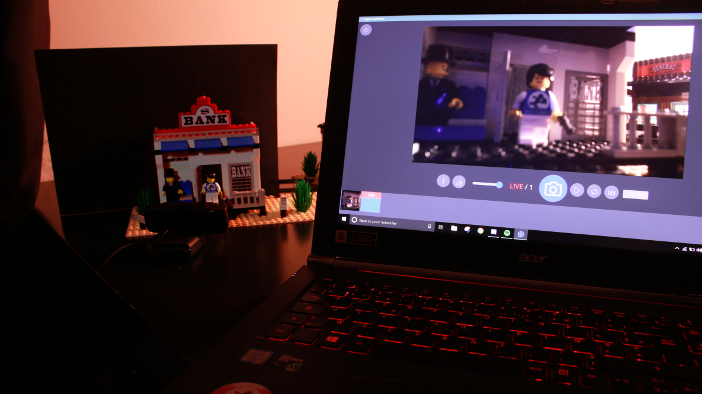

# EagleAnimation

 

**EagleAnimation** is an awesome, free and open-source stop motion animation software. It is available for Windows, macOS, Linux and also works with any web browser. It's a great alternative to _Stop
Motion Studio_, _Dragon Frame_ and _Boats Animator_.

👉 _This project is supported by Brick à Brack, the non-profit organization that owns [Brickfilms.com](https://brickfilms.com/) - The biggest brickfilming community, you can join us, it's free and
without ads!_ 🎥

- ✨ **DSLR cameras support** - Use and configure your DSLR camera directly.
- ❤️ **Friendly timeline** - Instantly preview your animation, duplicate and reorganize frames as you want.
- 😎 **The highest quality** - Use all the power of your camera and animate with the best quality possible!
- 💡 **Animator tools** - Thanks to onion skin, grid tools and difference mode, animating has never been so easy.
- 💾 **Easy export** - Export your animation to a video file or export frames to use them in video editing software.
- ⚙️ **Adjust camera settings** - Control and adjust your camera settings.
- 🪄 **Frame averaging** - Capture several frames and merge them to reduce picture noise automatically.
- ✂️ **Masking** - Capture two shots and paint away what you want to hide, no green screen needed.
- 🥖 **Oui-Oui-Baguette** - The software is available in several languages to allow everyone to use it.

## Get started

- 🚀 Downloads are available on the [Github releases page](https://github.com/brick-a-brack/eagle-animation/releases).
- ☁️ Try it directly in your browser using [the Web hosted version](https://app.eagle-animation.com/).
- 🐛 You can report issues on the [Github issue tracker](https://github.com/brick-a-brack/eagle-animation/issues).
- 🧑‍⚖️ The source code is published under [GPLv3](http://www.gnu.org/licenses/gpl.html).

## F.A.Q. (Frequently Asked Questions)

### How to fix: "Eagle Animation" is damaged and can't be opened. You should move it to Trash.

This error occurs because Eagle Animation files are not signed. You can fix the issue by following these instructions:
- Install the app using the .dmg file like any other app
- Open a terminal
- Type `xattr -c "/Applications/Eagle Animation.app"` and press enter

Video details: [https://www.youtube.com/watch?v=ceGovao817g](https://www.youtube.com/watch?v=ceGovao817g).

### What languages does Eagle Animation support?

Eagle Animation is available in English, French, German, Spanish, Italian, Portuguese, Polish, Esperanto, Bulgarian, Czech, Danish, Greek, Croatian, Latvian, Hungarian, Dutch, Romanian, Slovak, Lithuanian, Slovenian, Finnish, Swedish and Russian.

### Is Eagle Animation compatible with my camera?

Eagle Animation is compatible webcams and some DSLR cameras on the desktop version.

### Is there a mobile version of Eagle Animation?

There is currently no mobile version of Eagle Animation but you can use [the Web hosted version](https://app.eagle-animation.com/) on tablets.

## Contribute

Feel free to make pull-requests, help us to translate the software or report issues 😉

The logo was created by Nishant Shukla and sound effects were obtained from [Zapsplat.com](https://zapsplat.com/).

## Build and configuration

Some variables can be configured using a `.env` file, values with a "\*" are required.

| **Name**                      | **Description**                                                                                         | **Example**                                |
| ----------------------------- | ------------------------------------------------------------------------------------------------------- | ------------------------------------------ |
| VITE_PUBLIC_URL               | The full URL of the assets server, must end with a slash "/". If it is not defined, we will use "/". | `https://app.eagle-animation.com/`         |
| VITE_COMMIT_HASH              | The hash of the current git commit, if it is not provided, the bundle will be flagged as "local".       | `cda02bf88498ce97d947fb357a6e4f459812122a` |
| VITE_TOUCAN_CAMERA_SERVER_URL | Used for development, to choose the Toucan Camera Server instance.                                      | `http://192.168.1.14:8040/?token=RH6EH3`   |

### Build process

- Run `npm i` to install dependencies.
- Update `src/config.js` file if needed.
- Run `npm run build:win`, `npm run build:linux`, `npm run build:mac` and `npm run build:web` to build release files.

### Release process

- Update `version` value in `package.json` if needed.
- Create a draft release on Github and tag it with the same version number: `vX.X.X`.
- Merge your branch (dev into master).

### Development mode

- Run `npm i` to install dependencies.
- Run `npm run start:electron` to launch the application in dev mode.
- Run `npm run start:web` to launch the web app in dev mode.

### Telemetry

To improve the quality of **Eagle Animation**, runtime errors and application events are automatically reported to developers using [PostHog](https://posthog.com/). You can disable telemetry by
setting `POSTHOG_TOKEN` to `""` in `src/config.js` and rebuilding the app.

## Compatibility

Some features are device-dependent or platform-limited. Here's a summary table.

| Feature               | Downloadable app | Web (Chrome¹) | Web (Firefox / Safari) |
| --------------------- | ---------------- | ------------- | ---------------------- |
| Take photos           | 🟢               | 🟢            | 🟢                     |
| Export frames         | 🟢               | 🟢            | 🟢                     |
| Export video          | 🟢               | 🟢            | 🟢                     |
| Camera settings       | 🟢               | 🟡²           | 🔴                     |
| DSLR support          | 🟢³              | 🟡⁴           | 🔴                     |
| Remote camera support | 🟢               | 🔴            | 🔴                     |
| Workshop features     | 🟢               | 🔴            | 🔴                     |

1. Including Chromium-based browsers (Edge, Brave, Opera, Arc, etc.).
2. Webcam settings are only supported on Windows and Linux.
3. Canon support on Windows, additional devices supported on macOS and Linux.
4. Using WebUSB, can require advanced configuration on Windows.

## Camera support and implementation

Camera support varies based on devices and operating systems, Eagle Animation uses [Toucan Camera Server](https://github.com/brick-a-brack/toucan-camera-server) to handle camera complexity.
